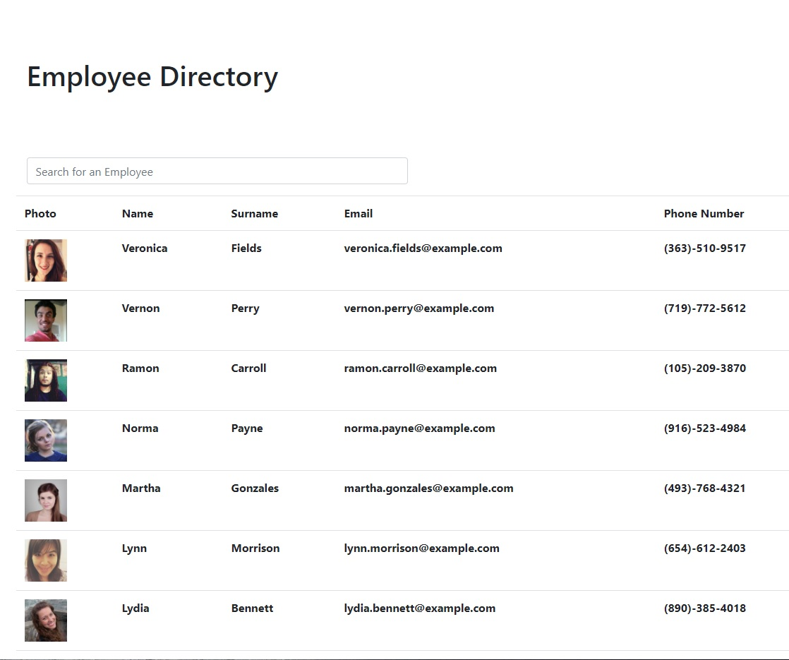

# **Employee Directory**

## Table of Contents

* [Description](#description)
* [ScreenShot](#screenshot)
* [Requirements](#requirement)
* [Installation](#installation)
* [Contributing](#contributing)

## Description
---
It's an employee directory that helps you keep track of your employees where you can sort them, filter them and see their information.

## ScreenShot

## Requirements
---

For this assignment, I created an employee directory with React. This assignment required me to break up my application's UI into components, manage component state, and respond to user events.

User Story

* As a user, I want to be able to view my entire employee directory at once so that I have quick access to their information.

Business Context

An employee or manager would benefit greatly from being able to view non-sensitive data about other employees. It would be particularly helpful to be able to filter employees by name.

Acceptance Criteria

Given a table of random users generated from the [Random User API](https://randomuser.me/), when the user loads the page, a table of employees should render. 

The user should be able to:

  * Sort the table by at least one category

  * Filter the users by at least one property.

## Installation
---
No need for any installation for this project.

See the deployed website: https://erenozgur98.github.io/employee-directory-react/

See the repository in here: https://github.com/erenozgur98/employee-directory-react

## Contributing
---
Please review and let me know if you see any ways this code can be improved!

